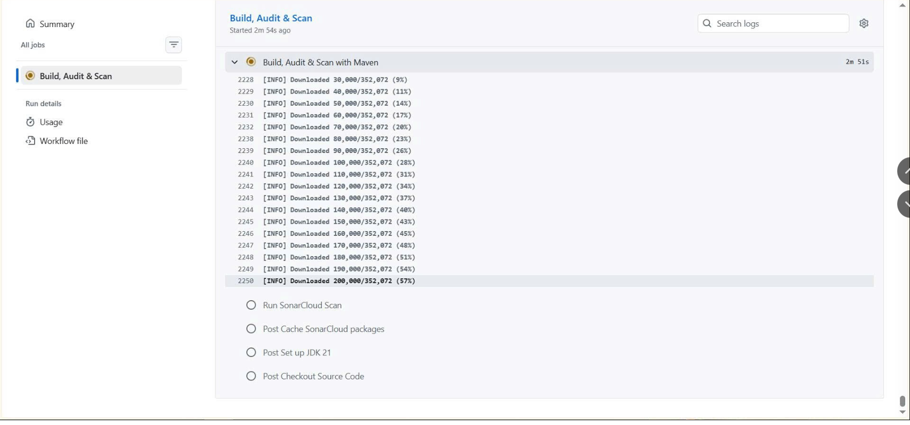
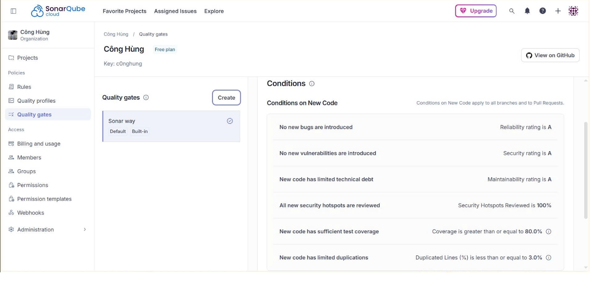
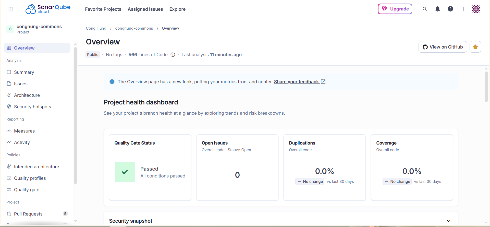
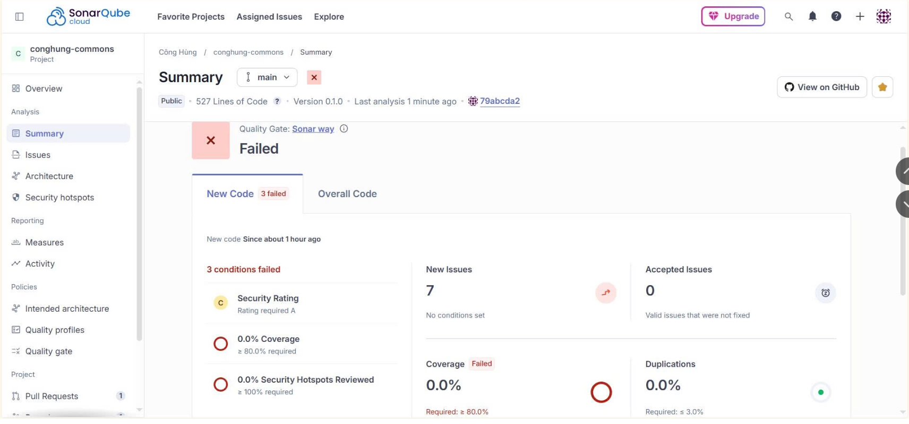
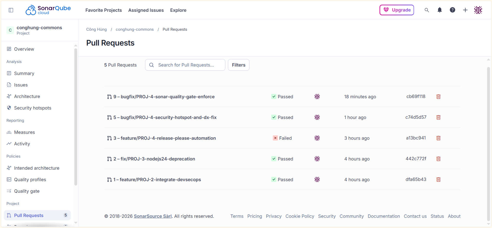

# conghung-commons

[](https://github.com/c0nghung/conghung-commons/actions/workflows/ci.yml)
[](https://github.com/c0nghung/conghung-commons/actions/workflows/cd.yml)
[](https://sonarcloud.io/summary/new_code?id=C0ngHung_conghung-commons)
[](https://sonarcloud.io/summary/new_code?id=C0ngHung_conghung-commons)
[](https://sonarcloud.io/summary/new_code?id=C0ngHung_conghung-commons)

Lightweight shared infrastructure kernel for Spring Boot web applications.

## What's Included

| Package | Class | Purpose |
|---------|-------|---------|
| `api` | `ApiResult<T>` | Unified API response envelope with nested `result` (responseCode + description), payload `data`, `error` object and `timestamp` |
| `api` | `PageResponse<T>` | Immutable paginated response envelope (1-based page index, null-safe items, Spring Data `Page` factory) |
| `api` | `ResultInfo` | Nested status carrier holding `responseCode` and `description` |
| `api` | `ErrorDetail` | Structured validation error details holding field-level violations (`details` Map) |
| `exception` | `ResponseCode` | Stable numeric error code enum for generic infrastructure concerns |
| `exception` | `ApiException` | Abstract base exception with `ResponseCode` + `HttpStatus` |
| `exception` | `BusinessException` | Domain/business rule violation (HTTP 422) |
| `exception` | `TechnicalException` | Infrastructure failure (HTTP 503) |
| `exception` | `IntegrationException` | External system failure (HTTP 502) |
| `exception` | `UnknownResultException` | Timeout/unknown transaction result (HTTP 202) |
| `exception` | `ResourceNotFoundException` | Resource not found (HTTP 404) |
| `exception` | `GlobalExceptionHandler` | Centralized `@RestControllerAdvice` (ordered `LOWEST_PRECEDENCE`), auto-registered via auto-configuration |
| `autoconfigure` | `CommonsAutoConfiguration` | Auto-registers `GlobalExceptionHandler` — no component-scan / package-root required |
| `web` | `TraceIdFilter` | **(Deprecated since 0.2.10; no longer auto-registered since 0.3.1)** Pass-through filter kept for source compatibility |
| `util` | `SortParser` | Utility for parsing sorting query parameters (e.g. `field:dir`) with ASCII-safe, default fallback to `id:asc` |
| `util` | `PageableFactory` | Utility for generating `Pageable` parameters from client query inputs (handling nulls and clamping size limits) |

## Error Code Ranges

This library provides **generic infrastructure codes only**. Domain-specific codes should be defined in each microservice.

| Code | Enum | Category |
|------|------|----------|
| `0000` | `COMMON_SUCCESS` | Success |
| `1001` | `REQ_VALIDATION_ERROR` | Invalid input data |
| `1002` | `REQ_BAD_REQUEST` | Bad request |
| `2001` | `AUTH_UNAUTHORIZED` | Unauthorized |
| `2101` | `PERM_FORBIDDEN` | Forbidden |
| `4001` | `DATA_NOT_FOUND` | Resource not found |
| `4002` | `DATA_CONFLICT` | Conflict request |
| `9999` | `SYS_INTERNAL_ERROR` | Internal server error |

## Requirements

- Java 21+
- Spring Boot 4.x (Spring Framework 7.x)

## Installation

### Maven (GitHub Packages)

Add the repository to your `pom.xml`:

```xml
<repositories>
    <repository>
        <id>github</id>
        <url>https://maven.pkg.github.com/c0nghung/conghung-commons</url>
    </repository>
</repositories>
```

Add the dependency:

```xml
<dependency>
    <groupId>vn.conghung</groupId>
    <artifactId>conghung-commons</artifactId>
    <version>0.2.12</version>
</dependency>
```

> **Auto-configuration (since 0.3.1):** `GlobalExceptionHandler` is registered automatically via Spring Boot auto-configuration (`META-INF/spring/...AutoConfiguration.imports`). You get it simply by having the dependency — **no `@ComponentScan` tuning or shared `vn.conghung` package root required**, regardless of your application's base package.

Configure authentication in `~/.m2/settings.xml`:

```xml
<servers>
    <server>
        <id>github</id>
        <username>YOUR_GITHUB_USERNAME</username>
        <password>YOUR_GITHUB_PAT</password>
    </server>
</servers>
```

### Checking Available Versions

To check the list of all published versions, release notes, and inspect what version your application is currently running:

1. **View Published Versions (GitHub Packages)**: Visit the public [c0nghung/conghung-commons Packages Page](https://github.com/c0nghung/conghung-commons/packages/) to see all published releases and snapshots.
2. **View Release History (Changelog)**: Read the [CHANGELOG.md](CHANGELOG.md) in the root of this repository or navigate to the **Releases** tab on GitHub to see what bug fixes, features, or breaking changes are introduced in each version.
3. **Verify Your Current Version (Local Application)**: If you want to check exactly what version of `conghung-commons` your microservice is currently resolving, run this command in your microservice's root directory:
   ```bash
   mvn dependency:tree -Dincludes=vn.conghung:conghung-commons
   ```

### Understanding Maven Versions (SNAPSHOT vs. RELEASE)

For developers consuming this library, it is vital to understand the difference between the two version types published in our package registry:

| Version Type | Example | Stability | Mutability (Tính biến động) | Use Case |
| :--- | :--- | :--- | :--- | :--- |
| **SNAPSHOT** | `0.2.5-SNAPSHOT` | **Developmental (WIP)**. Active work-in-progress. Might contain breaking changes or untested code. | **Mutable (Khả biến)**. Multiple builds can be deployed under the same version. Maven automatically downloads the latest timestamped build. | Local integration, active collaboration, and pre-release testing between teams. |
| **RELEASE** | `0.2.4` | **Stable (Production-Ready)**. Fully tested, secure, and static code. | **Immutable (Bất biến)**. Once published, the code can never change. Safe for production. | Production workloads, stable customer deployments. |

> [!WARNING]
> **Production Rule**: Never deploy a microservice to production with a dependency ending in `-SNAPSHOT`. Doing so violates the principle of **Build Reproducibility** (lặp lại quy trình build) and introduces the risk of pulling untested changes at compile time. Always use a finalized **RELEASE** version for production!

## Usage Examples

This library is designed for instant plug-and-play integration. Here is how to leverage its core capabilities in your microservices:

### 1. Centralized API Response Envelope (`ApiResult`)
Return `ApiResult<T>` as your controller response. The `traceId` is intentionally excluded from the response body to hide internal implementation details (it is synchronized with MDC and printed to internal logs, and passed back via the `X-Trace-Id` header):

```java
import vn.conghung.common.api.ApiResult;

@RestController
@RequestMapping("/api/v1/users")
public class UserController {

    @GetMapping("/{id}")
    public ApiResult<UserResponse> getUser(@PathVariable Long id) {
        UserResponse user = userService.findById(id);
        // ApiResult.ok(data) → HTTP 200, code "0000" (result is fully automated, no traceId pollution)
        return ApiResult.ok(user);
    }

    @PostMapping
    public ApiResult<UserResponse> createUser(@RequestBody @Valid CreateUserRequest req) {
        UserResponse created = userService.create(req);
        return ApiResult.ok("User created successfully", created);
    }

    // Void operations (delete, soft-delete, logout) — no data to return
    @DeleteMapping("/{id}")
    public ResponseEntity<ApiResult<Void>> deleteUser(@PathVariable Long id) {
        userService.delete(id);
        return ResponseEntity.ok(ApiResult.ok());                              // no message
    }

    @PatchMapping("/{id}/deactivate")
    public ResponseEntity<ApiResult<Void>> deactivateUser(@PathVariable Long id) {
        userService.deactivate(id);
        return ResponseEntity.ok(ApiResult.noData("User deactivated successfully")); // with message
    }
}
```

> **Design note:** This library uses `200 OK + ApiResult<Void>` for void operations rather than `204 No Content`.
> HTTP 204 prohibits a body (RFC 9110 §15.3.5) — combining it with an `ApiResult` wrapper is a contradiction.
> For internal microservices, uniform response parsing (`200` everywhere) takes priority over strict HTTP semantics.

### API Response Formats

#### Success Response Envelope
```json
{
  "result": {
    "responseCode": "0000",
    "description": "Success"
  },
  "data": {
    "userId": 123,
    "email": "user@example.com"
  },
  "timestamp": "2026-05-25T13:49:00Z"
}
```

#### Simple Business Error Response (No Details)
```json
{
  "result": {
    "responseCode": "4001",
    "description": "Resource not found"
  },
  "timestamp": "2026-05-25T13:49:00Z"
}
```

#### Validation Error Response (Structured details map)
```json
{
  "result": {
    "responseCode": "1001",
    "description": "Invalid input data"
  },
  "error": {
    "details": {
      "amount": "must not be null",
      "currency": "must not be blank"
    }
  },
  "timestamp": "2026-05-25T13:49:00Z"
}
```


### 2. Robust Exception Throwing & Centralized Handling
Throw appropriate subclasses of `ApiException`. The included `GlobalExceptionHandler` (`@RestControllerAdvice`) automatically intercepts these, maps them to corresponding HTTP statuses, and logs them at correct severity levels without leaking system details:

```java
import vn.conghung.common.exception.BusinessException;
import vn.conghung.common.exception.ResourceNotFoundException;
import vn.conghung.common.exception.IntegrationException;
import vn.conghung.common.exception.ResponseCode;

// Domain rule violation → HTTP 422
if (amount.compareTo(balance) > 0) {
    throw new BusinessException(ResponseCode.REQ_VALIDATION_ERROR, "Insufficient balance for withdrawal");
}

// Resource absence → HTTP 404
User user = repository.findById(id)
    .orElseThrow(() -> new ResourceNotFoundException("User not found"));

// External system failure → HTTP 502
try {
    paymentGateway.charge(order);
} catch (TimeoutException e) {
    throw new IntegrationException(
        ResponseCode.SYS_INTERNAL_ERROR, "Payment gateway timeout",
        "PAY-GW", correlationId, e
    );
}
```

### 3. Standardized Paginated Response (`PageResponse`)

Use `PageResponse<T>` as the return type for all list/search endpoints. It enforces a consistent, client-friendly structure with 1-based page numbering and a null-safe `items` list.

**In your service layer** — use the static factory to eliminate boilerplate `toPageResponse()` helpers:

```java
import vn.conghung.common.api.PageResponse;

@Override
@Transactional(readOnly = true)
public PageResponse<UserResponseDto> findAll(int page, int size) {
    // 1-based page from client → 0-based for Spring Data
    Pageable pageable = PageRequest.of(page - 1, size);
    Page<User> userPage = userRepository.findAll(pageable);

    // Factory method maps entity → DTO and builds PageResponse in one step
    return PageResponse.of(page, userPage, userMapper::toDto);
}
```

**In your controller** — wrap inside `ApiResult.ok()` for a consistent envelope:

```java
@GetMapping
public ApiResult<PageResponse<UserResponseDto>> getUsers(
        @RequestParam(defaultValue = "1") int page,
        @RequestParam(defaultValue = "20") int size) {
    return ApiResult.ok(userService.findAll(page, size));
}
```

**JSON response format:**

```json
{
  "result": { "responseCode": "0000", "description": "Success" },
  "data": {
    "pageNo": 1,
    "pageSize": 20,
    "totalPages": 5,
    "totalElements": 98,
    "items": [
      { "userId": 1, "email": "alice@example.com" },
      { "userId": 2, "email": "bob@example.com" }
    ]
  },
  "requestDateTime": "2026-06-08T05:00:00Z"
}
```

> **Timezone (since 0.3.1):** `requestDateTime` is stamped in **UTC** (`Z`) on every response, success and error alike. Previously it used `Asia/Ho_Chi_Minh` (UTC+7) — see the `BREAKING CHANGE` note in the changelog. Consumers displaying local time must convert.

### 4. Sorting & Pagination Query Parsing (`PageableFactory` / `SortParser`)

When accepting page, size, and sorting specifications from client REST queries, use `PageableFactory` to securely parse and construct a Spring Data `Pageable` request. It automatically handles default fallbacks, null/empty parameters, and prevents DOS attacks by clamping the maximum allowed page size to `100`.

**In your controller layer**:

```java
import vn.conghung.common.util.PageableFactory;
import org.springframework.data.domain.Pageable;

@GetMapping
public ApiResult<PageResponse<UserResponseDto>> getUsers(
        @RequestParam(defaultValue = "1") int page,
        @RequestParam(defaultValue = "20") int size,
        @RequestParam(required = false) String sort) {
    
    // PageableFactory.of(...) parses "field:asc" or "field:desc" and clamps size limits
    Pageable pageable = PageableFactory.of(page, size, sort);
    
    return ApiResult.ok(userService.findAll(pageable));
}
```

### 5. End-to-End Log Traceability (Deprecated)

> [!WARNING]
> **Deprecated since v0.2.10**: `TraceIdFilter` is now deprecated and is kept only as a pass-through filter to avoid compilation/runtime failures in downstream microservices. It no longer extracts headers, generates UUIDs, or writes to MDC. Trace propagation should be handled via modern distributed tracing tools like Spring Cloud Sleuth or Micrometer.
>
> **Since v0.3.1**: the `@Component` stereotype was removed, so this no-op filter is **no longer auto-registered** into the servlet chain. The class is retained for source compatibility and is slated for removal in the next major.


## Design Principles

- **Minimal footprint** — No Spring Boot starters, no embedded Tomcat, no Lombok.
- **Infrastructure only** — No business logic, no domain-specific code.
- **Immutable DTOs** — All response objects use Java `record` types.
- **Extensible error codes** — Each microservice defines its own domain-specific `ResponseCode`.
- **Traceability** — Every API response includes a `traceId` synchronized with SLF4J MDC.

## 🛡️ DevSecOps & Contribution Guidelines

This repository enforces a strict, fully automated **DevSecOps Pipeline** and **Branch Protection Gate** to ensure that every release artifact is secure, highly performant, and clean.

### 1. PR Quality Gate & Security Check (CI)
Every Pull Request (PR) opened against `main` automatically triggers the **Continuous Integration (CI)** pipeline:
* **SAST (SpotBugs + FindSecBugs)**: Scans bytecode for security hotspots and critical bugs.
* **SCA (OWASP Dependency-Check)**: Audits all third-party libraries for open CVE vulnerabilities.
* **Code Quality (SonarCloud)**: Runs static analysis for maintainability, duplications, and coverage.


*Figure 1: GitHub Actions CI workflow performing automated audits and scans.*

* **Quality Gate Enforcer**: The pipeline **waits** for the SonarCloud Quality Gate results. If the scan fails the Quality Gate, the pipeline turns **RED** and GitHub's Branch Protection Rules will **block the PR from being merged**.


*Figure 2: The standard "Sonar way" Quality Gate requirements enforced on all new code.*

#### 🟢 Passed (Safe to Merge) vs 🔴 Failed (Blocked) States
* When all quality gate conditions are met, the project health reports green and the PR is ready to merge:
  
  
  *Figure 3: Clean project health dashboard on SonarCloud (Passed).*

* If any check fails, the gate blocks the pipeline immediately, protecting the main codebase:

  
  *Figure 4: Automated block triggered by low test coverage or security vulnerabilities (Failed).*

### 2. Conventional Commits Discipline (Release Automation)
We use `release-please` to automatically generate semantic version bumps and update the `CHANGELOG.md` upon merging PRs to `main`.
* **PR Title Format**: Your PR title **MUST** follow [Conventional Commits](https://www.conventionalcommits.org/):
  ```text
  <type>(<scope>): <short description>
  ```
  *Examples*: `feat(api): add new validation filters`, `fix(security): sanitize exception logging params`
* ⚠️ **Strict Syntax Warning**: Use standard **parentheses `()`** for the scope. Using **brackets `[]`** (e.g. `feat[api]: ...`) will fail to be parsed by the automation bot, preventing automated release PRs from being generated.


*Figure 5: Historical record of analyzed pull requests and branches on SonarCloud.*

### 3. How to Inspect Quality Gate Failures (For Contributors)
If your PR fails the Quality Gate and is blocked from merging, don't worry! Follow these steps to find and fix the issues:
1. **Check the PR Comments**: SonarCloud automatically decorates your PR with a summary comment. Click on the link **"See analysis details on SonarCloud"** inside that comment.
2. **Access the Public Dashboard**: 
   * Go directly to our public [conghung-commons SonarCloud Dashboard](https://sonarcloud.io/summary/new_code?id=C0ngHung_conghung-commons).
   * Click **"Log in"** at the top right of the page and select **"With GitHub"** (no special permissions are requested, as our repository is **100% public**).
3. **Find your Branch / PR**:
   * On the dashboard, click on the **"Pull Requests"** tab to see the active analysis of all pull requests.
   * Click on your specific branch name to open its dedicated report.
4. **Pinpoint the Issues**:
   * Navigate to the **"Issues"** tab on the report dashboard to see the exact line of code, the rule violated (e.g. Code Smell, Bug, or Vulnerability), and a detailed explanation of how to fix it.
   * Go to the **"Security Hotspots"** tab to review and resolve sensitive code patterns.
5. **Local Prevention (Recommended)**: To catch these issues before pushing to GitHub, install the **SonarLint** extension in your IDE (IntelliJ IDEA, VS Code, Eclipse) and bind it to our SonarCloud project (`C0ngHung_conghung-commons`). It will give you instant, real-time feedback as you write code!

## License

[MIT](LICENSE)
