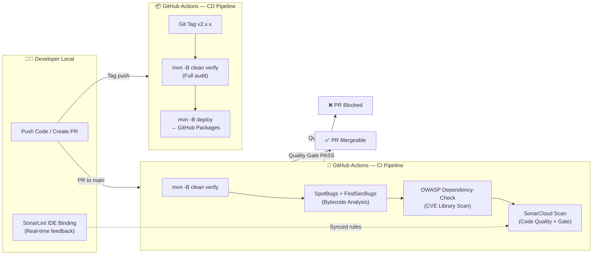
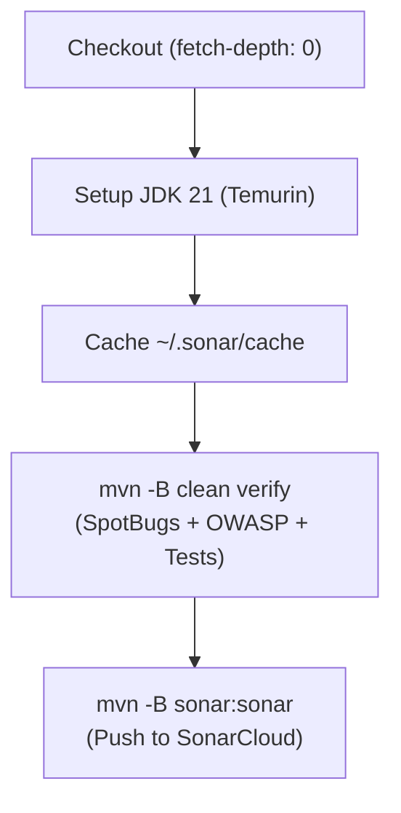
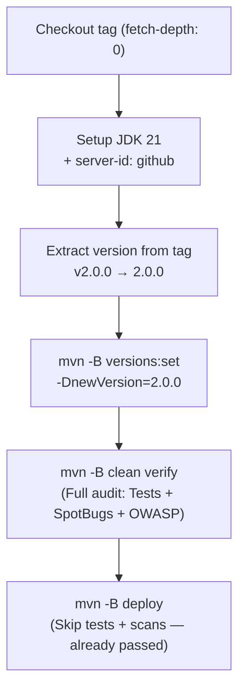

# Implementation Plan: conghung-commons v2.0.0 — DevSecOps CI/CD

> **Objective**: Tích hợp quy trình bảo mật tự động (DevSecOps) vào thư viện `conghung-commons`, biến nó thành một dependency đáng tin cậy tuyệt đối thông qua GitHub Actions CI/CD + SonarCloud + SpotBugs + OWASP Dependency-Check.
>
> **Status**: ✅ Triển khai hoàn tất — Tài liệu này phục vụ mục đích tham khảo (Reference Guide) cho các dự án khác.

---

## 📐 Kiến trúc Tổng quan Pipeline



---

## 🏗️ Phase 1: SonarCloud Onboarding (Hướng dẫn từng bước)

> **Quan trọng**: SonarCloud là phiên bản cloud miễn phí của SonarQube, được SonarSource vận hành. Bạn không cần dựng server, không cần Docker. Mọi thứ chạy trên `https://sonarcloud.io`.

### SonarCloud vs SonarQube Server — So sánh nhanh

| Tiêu chí | SonarQube Server (Self-hosted) | SonarCloud (Managed) |
|:---|:---|:---|
| **Hosting** | Tự dựng Docker / VM | SonarSource vận hành trên cloud |
| **Chi phí** | Miễn phí (Community Edition) | Miễn phí cho public repo |
| **URL** | `http://localhost:9001` | `https://sonarcloud.io` |
| **Token** | Tạo trên Web UI (`sqp_`, `sqa_`, `squ_`) | Tạo trên Web UI (1 loại duy nhất) |
| **Quality Profile** | Cấu hình thủ công | Cung cấp sẵn "Sonar Way" chuẩn |
| **CI/CD Integration** | Cần cấu hình `sonar.host.url` | Chỉ cần `SONAR_TOKEN` + org key |
| **PR Decoration** | Plugin Jenkins / GitLab | **Tích hợp sẵn GitHub PR comments** |
| **Security Hotspots** | Có | Có + Review workflow trực quan |

### Các bước thiết lập SonarCloud

#### Bước 1: Đăng nhập & Tạo Organization
1. Truy cập [https://sonarcloud.io](https://sonarcloud.io)
2. Nhấn **"Log in with GitHub"** → Đăng nhập bằng tài khoản GitHub
3. SonarCloud sẽ tạo một **Organization** tương ứng với GitHub account/org
   - Organization key thường là: `{github-username}` (lowercase)
4. Nếu chưa có → Nhấn **"Create new organization"** → Chọn **"Free plan"** (cho public repos)

#### Bước 2: Import Repository
1. Trong SonarCloud dashboard → Nhấn **"+"** (góc phải trên) → **"Analyze new project"**
2. Chọn repository cần import từ danh sách
3. Chọn **"Previous version"** cho mục New Code Definition (phù hợp SemVer release flow)
4. SonarCloud sẽ tạo project với:
   - **Project Key**: `{Org}_{repo}` (Ví dụ: `C0ngHung_conghung-commons`)
   - **Organization**: `{org-key}` (Ví dụ: `c0nghung`)

> [!IMPORTANT]
> Hãy ghi lại chính xác **Project Key** và **Organization Key** được SonarCloud hiển thị. Các giá trị này phân biệt hoa/thường (case-sensitive) và sẽ được dùng trong `pom.xml` cùng các workflow CI/CD.

#### Bước 3: Chọn Analysis Method = GitHub Actions
1. Trong project settings → **"Administration"** → **"Analysis Method"**
2. **Tắt "Automatic Analysis"** (quan trọng! vì chúng ta sẽ tự kiểm soát qua GitHub Actions để chạy các phân tích bytecode-level như SpotBugs)
3. Chọn **"With GitHub Actions"**
4. Chọn **"Maven"** ở bước 2 để xem mẫu cấu hình cho `pom.xml`
5. SonarCloud sẽ hiển thị hướng dẫn, bao gồm **SONAR_TOKEN**. Copy lại token này.

#### Bước 4: Cấu hình GitHub Repository Secrets
Vào GitHub repo → **Settings** → **Secrets and variables** → **Actions**:

| Secret Name | Value | Mục đích |
|:---|:---|:---|
| `SONAR_TOKEN` | Token từ SonarCloud | Xác thực scan |
| `NVD_API_KEY` | API Key NVD đã có | OWASP Dependency-Check |

> [!NOTE]
> `GITHUB_TOKEN` không cần tạo thủ công — GitHub Actions tự động cung cấp biến này cho mỗi workflow run. Nó được dùng để `mvn deploy` lên GitHub Packages và để SonarCloud đăng PR comments.

#### Bước 5: Kết nối SonarLint IDE (Project Binding)

Để các lập trình viên nhận phản hồi chất lượng code ngay trong IDE (IntelliJ IDEA):

1. **Tạo User Token riêng**: Mỗi developer tự vào SonarCloud → **My Account** → **Security** → **Generate Tokens** → Tạo token cá nhân (ví dụ: `IntelliJ-SonarLint`).
2. **Cấu hình Connection trong IDE**: **Settings** → **Tools** → **SonarLint** (hoặc SonarQube for IDE) → Tab **Settings** → Nhấn `+` → Chọn **SonarCloud** → Dán token → Chọn Organization.
3. **Binding Project**: Tab **Project Settings** → Tích chọn **"Bind to SonarQube / SonarCloud"** → Chọn Connection → Chọn đúng **Project Key**.

> [!TIP]
> Mỗi developer dùng **token cá nhân riêng**. Tuyệt đối **KHÔNG chia sẻ token** để đảm bảo trách nhiệm giải trình (accountability) và an toàn thông tin.

---

## 🏗️ Phase 2: Tích hợp DevSecOps Plugins vào `pom.xml`

### Tổng quan thay đổi

```diff
 <properties>
     <java.version>21</java.version>
     <project.build.sourceEncoding>UTF-8</project.build.sourceEncoding>
+    <!-- DevSecOps Plugin Versions -->
+    <spotbugs-maven-plugin.version>4.8.6.6</spotbugs-maven-plugin.version>
+    <findsecbugs-plugin.version>1.13.0</findsecbugs-plugin.version>
+    <dependency-check-maven.version>12.1.0</dependency-check-maven.version>
+    <!-- SonarCloud Integration -->
+    <sonar.host.url>https://sonarcloud.io</sonar.host.url>
+    <sonar.organization>{your-org-key}</sonar.organization>
+    <sonar.projectKey>{Your-Project-Key}</sonar.projectKey>
+    <sonar.java.spotbugs.reportPaths>target/spotbugsXml.xml</sonar.java.spotbugs.reportPaths>
+    <sonar.dependencyCheck.jsonReportPath>target/dependency-check-report.json</sonar.dependencyCheck.jsonReportPath>
+    <sonar.dependencyCheck.htmlReportPath>target/dependency-check-report.html</sonar.dependencyCheck.htmlReportPath>
 </properties>
```

### Plugins cần thêm vào `<build><plugins>`

1. **SpotBugs + FindSecBugs**: Quét bytecode tìm lỗi logic và bảo mật (SAST)
   - Effort: `Max`, Threshold: `Low` → Quét tối đa, không bỏ sót
   - `failOnError: false` → Report-only mode (Phase 1 Graduated Enforcement)
2. **OWASP Dependency-Check**: Quét CVE thư viện bên thứ 3 (SCA)
   - Format: `ALL` → Xuất cả JSON, HTML, CSV
   - `knownExploitedEnabled: false` → Tắt CISA KEV (tránh lỗi kết nối trên CI)
   - `suppressionFile: suppression.xml` → Quản lý false positives có hệ thống

> [!IMPORTANT]
> Phiên bản `dependency-check-maven` trong guide cũ là `10.0.4`. Phiên bản ổn định mới nhất hiện tại là `12.1.0` với cải thiện đáng kể về tốc độ và độ chính xác NVD matching. Đề xuất nâng cấp.

### File mới cần tạo

| File | Mục đích |
|:---|:---|
| `suppression.xml` | Danh sách False Positive CVE đã xác nhận. Schema: `dependency-suppression.1.3.xsd` |

---

## 🏗️ Phase 3: GitHub Actions Workflows

### 3A. CI Pipeline — `ci.yml` (Validation trên mỗi PR + Push main)

**Triggers**:
- `push` vào `main` ← **Bắt buộc** để SonarCloud thiết lập baseline "New Code" reference branch
- `pull_request` (`opened`, `synchronize`, `reopened`) vào `main`, `master`, `feature/**`, `bugfix/**`, `hotfix/**`

**Jobs flow**:


**Đặc điểm kỹ thuật quan trọng**:
- `fetch-depth: 0`: Bắt buộc để SonarCloud phân tích blame history đầy đủ
- `mvn -B` (Batch mode): Tắt progress bar, giảm nhiễu log trên CI
- Cache `~/.sonar/cache` để tăng tốc SonarCloud scan
- Cache Maven via `setup-java` built-in cache: `'maven'`
- **Tách biệt bước Build và SonarCloud**: Nếu build fail → dừng ngay, không gọi SonarCloud (tiết kiệm thời gian phân tích)

### 3B. CD Pipeline — `cd.yml` (Publishing khi tạo Tag)

**Triggers**: Push tag `v*` (ví dụ: `v2.0.0`)

**Jobs flow**:


**Đặc điểm kỹ thuật quan trọng**:
- `fetch-depth: 0`: Full clone để SCM metadata không bị thiếu khi Maven đọc thông tin Git
- Tự động trích xuất số phiên bản từ tag name (ví dụ: `v2.0.0` → `2.0.0`)
- Sử dụng `mvn versions:set` để đồng bộ version trong `pom.xml` với tag
- **Chạy verify đầy đủ trước khi deploy**: Đảm bảo không có artifact nào bị xuất bản mà chưa qua kiểm tra bảo mật
- `mvn deploy` skip tests/scans vì đã pass ở bước verify trước đó
- `GITHUB_TOKEN` tự động xác thực cho `mvn deploy` lên GitHub Packages
- Permissions rõ ràng: `contents: write`, `packages: write`

---

## 🏗️ Phase 4: Chính sách Quality Gate — Đề xuất "Graduated Enforcement"

> [!TIP]
> **Đề xuất**: Áp dụng chiến lược **Graduated Enforcement** (Siết dần theo thời gian) thay vì chặn cứng ngay từ đầu. Điều này giúp team bắt đầu thuận lợi mà không bị sốc, sau đó dần nâng cao tiêu chuẩn.

### Giai đoạn 1 (Hiện tại — v2.0.0): Report + Warn
| Check | Hành vi CI | Lý do |
|:---|:---|:---|
| SpotBugs | Report only, không fail build | Cho phép team làm quen với output |
| OWASP CVE (CVSS < 7.0) | Report only | Medium trở xuống cho phép lên kế hoạch |
| OWASP CVE (CVSS ≥ 7.0) | **Fail build** | HIGH/CRITICAL phải chặn ngay |
| SonarCloud Quality Gate | Report kết quả vào PR comment | Cho phép override với approval |

### Giai đoạn 2 (Sau 1-2 sprint — v2.1.0+): Strict Enforcement
| Check | Hành vi CI | Lý do |
|:---|:---|:---|
| SpotBugs | **Fail build** nếu có bug level HIGH | Team đã quen, siết chặt |
| OWASP CVE (CVSS ≥ 4.0) | **Fail build** | Mở rộng phạm vi chặn |
| SonarCloud Quality Gate | **Required status check** (GitHub Branch Protection) | Không merge được nếu Quality Gate fail |

### Cấu hình GitHub Branch Protection Rule (Sau Phase 3)
1. Vào **Settings** → **Branches** → **Add rule** cho `main`
2. Check: **"Require status checks to pass before merging"**
3. Thêm required checks: `build-and-verify` (workflow job name)
4. Check: **"Require branches to be up to date before merging"**

---

## 🔐 Mô hình Bảo mật Secrets & Quyền truy cập

| Người dùng | SONAR_TOKEN (repo secret) | NVD_API_KEY (repo secret) | SonarCloud Dashboard | SonarLint IDE |
|:---|:---:|:---:|:---:|:---:|
| **Repository Owner** | Cấu hình 1 lần | Cấu hình 1 lần | ✅ Full access | Token cá nhân |
| **Collaborator** | ❌ Không thấy | ❌ Không thấy | ✅ Xem (public repo) | Token cá nhân |
| **CI/CD Runner** | ✅ Tự động inject | ✅ Tự động inject | N/A | N/A |
| **Người xem bên ngoài** | ❌ | ❌ | ✅ Xem (public repo) | N/A |

> [!NOTE]
> GitHub tự động mã hóa và ẩn (mask) tất cả Repository Secrets. Không collaborator nào có thể đọc giá trị gốc. CI/CD sử dụng secrets qua biến môi trường runtime mà không bao giờ in ra log.

---

## 📋 Task Breakdown (Checklist triển khai)

### Pre-requisites (Thực hiện thủ công trên browser)
- [x] Đăng nhập SonarCloud bằng GitHub
- [x] Import project vào SonarCloud
- [x] Tắt "Automatic Analysis" → Chọn "GitHub Actions"
- [x] Copy `SONAR_TOKEN`
- [x] Thêm GitHub Secret: `SONAR_TOKEN`
- [x] Thêm GitHub Secret: `NVD_API_KEY`
- [x] Kết nối SonarLint IDE (Project Binding)

### Code Changes
- [x] Cập nhật `pom.xml`: Thêm DevSecOps properties + plugins (SpotBugs, FindSecBugs, OWASP)
- [x] Tạo `suppression.xml` (empty template)
- [x] Tạo `.github/workflows/ci.yml` (CI: PR + push main)
- [x] Tạo `.github/workflows/cd.yml` (CD: tag-based release)
- [x] Cập nhật `README.md` thêm badge CI + SonarCloud
- [x] Cập nhật `CHANGELOG.md` (v0.2.0 entry)
- [x] Cập nhật Memory Bank (`progress.md`, `activeContext.md`, `techContext.md`)

### Verification
- [x] Local: `mvn clean compile` thành công
- [ ] Push PR → CI pipeline chạy xanh
- [ ] SonarCloud hiển thị kết quả phân tích
- [ ] Tag `v0.2.0` → CD pipeline deploy thành công lên GitHub Packages

---

## 📁 Cấu trúc File sau triển khai

```
conghung-commons/
├── .github/
│   └── workflows/
│       ├── ci.yml              ← CI: PR validation + push main (SonarCloud baseline)
│       └── cd.yml              ← CD: Tag-based release → GitHub Packages
├── document/
│   ├── devsecops-local-guide.md
│   └── v2-devsecops-implementation-plan.md  ← Tài liệu này
├── src/main/java/...
├── suppression.xml             ← OWASP False Positive list
├── pom.xml                     ← Updated with DevSecOps plugins + SonarCloud properties
├── README.md                   ← Updated with CI/CD + SonarCloud badges
├── CHANGELOG.md                ← v0.2.0 entry
└── memory-bank/                ← Updated docs
```
